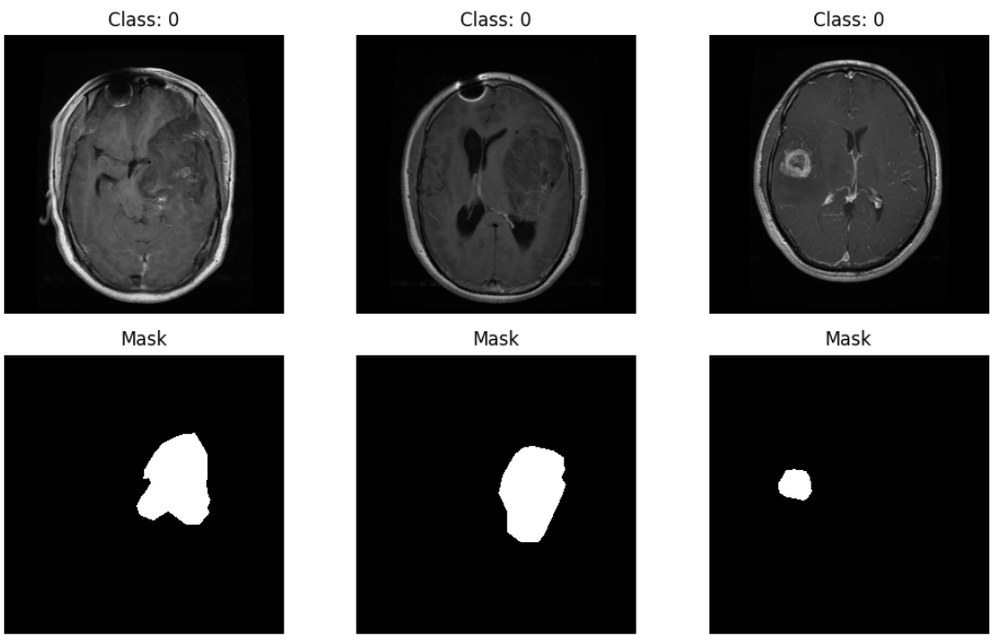
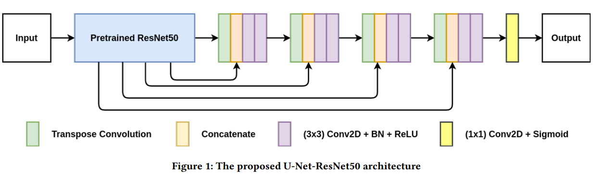

# Project_MultitaskModel

# Introduction

The "Multi-task Brain Tumor Classification and Segmentation" project focuses on building an advanced Deep Learning model to improve the diagnosis of brain tumors from Magnetic Resonance Imaging (MRI).

The core of this project is the application of Multi-task Learning, which enables a single model to simultaneously perform two critical tasks:
+ Classification: Identifying the type of tumor (e.g., Glioma, Meningioma, Pituitary).
+ Segmentation: Automatically outlining the precise location, shape, and boundaries of the tumor on the MRI scan.

By forcing the model to learn both what the tumor is and where it is at the same time, we aim to create a smarter, more efficient, and more accurate diagnostic support tool. This will help reduce the workload for clinicians and assist in better treatment planning.

# Dataset Introduction
  
**1. General Information**
Overview: BRISC 2025 is a large dataset containing 6,000 brain Magnetic Resonance Imaging (MRI) scans.
Image Type: All images are T1-weighted contrast-enhanced (T1-CE MRI), a modality that clearly highlights tumor boundaries.
Planes: The data includes all three anatomical planes (axial, sagittal, and coronal), which increases the diversity and robustness of the model.
Origin: The data was aggregated from multiple public sources (like Figshare and Br35H) and then carefully annotated by certified radiologists and medical experts, particularly to add high-quality segmentation masks.

**2. Label Characteristics for Multi-Tasking**
BRISC 2025 is perfectly structured for our multi-task model, as every data sample is associated with two types of labels:
    
A. Classification Labels (For the Classification Task): Each image is categorized into one of four (4) classes:
+ Glioma
+ Meningioma
+ Pituitary
+ No Tumor

B. Segmentation Labels (For the Segmentation Task): For the images that contain a tumor, the dataset provides a corresponding binary segmentation mask:
+ Pixels belonging to the tumor region are marked (e.g., white / value 1).
+ Pixels belonging to healthy brain tissue or the background are marked (e.g., black / value 0).

# Model Unet (ResNet50 for encoder)

# Workflow
1. Update config.yaml
2. Update secrets.yaml [Optional]
3. Update params.yaml
4. Update the entity
5. Update the configuration manager in src config
6. Update the components
7. Update the pipeline
8. Update the main.py
9. Update the dvc.yaml
10. app.py

# How to run>

1. Clone the reposity

    https://github.com/krishnaik06/Kidney-Disease-Classification-Deep-Learning-Project

2. Create ca conda environment 

    conda create -n project-env python=3.10
    conda activate project-env

3. Install th requirements

    pip install -r requirements.txt

4. Export  mlflow tracking

    export MLFLOW_TRACKING_REPO = ...
    export MLFLOW_TRACKING_USERNAME = ...

5. DVC cmd

    dvc init
    dvc repro
    dvc dag

# AWS CI/CD with github actions

**1. Login to AWS console**
**2. Create IAM user for deployment**

    #with specific access

    1. EC2 access : It is virtual machine

    2. ECR: Elastic Container registry to save your docker image in aws

    #Description: About the deployment

    1. Build docker image of the source code

    2. Push your docker image to ECR

    3. Launch Your EC2 

    4. Pull Your image from ECR in EC2

    5. Lauch your docker image in EC2

    #Policy:

    1. AmazonEC2ContainerRegistryFullAccess

    2. AmazonEC2FullAccess

**3. Creare ECR repo to store/save docker image**
    Save the URI: 566....amazonaws.com/

**4. Create EC2 machine (Ubuntu)**

**5. Open EC2 and Install docker in EC2 Machine**
    #optinal

    sudo apt-get update -y

    sudo apt-get upgrade

    #required

    curl -fsSL https://get.docker.com -o get-docker.sh

    sudo sh get-docker.sh

    sudo usermod -aG docker ubuntu

    newgrp docker

**6. Configure EC2 as self-hosted runner**
    setting -> actions -> ruuner -> self hosted runner -> choose os -> the run command one by one

**7. Setup github secrets:**
    AWS_ACCESS_KEY_ID=

    AWS_SECRET_ACCESS_KEY=

    AWS_REGION = us-east-1

    AWS_ECR_LOGIN_URI = demo>>  566373416292.dkr.ecr.ap-south-1.amazonaws.com

    ECR_REPOSITORY_NAME = simple-app